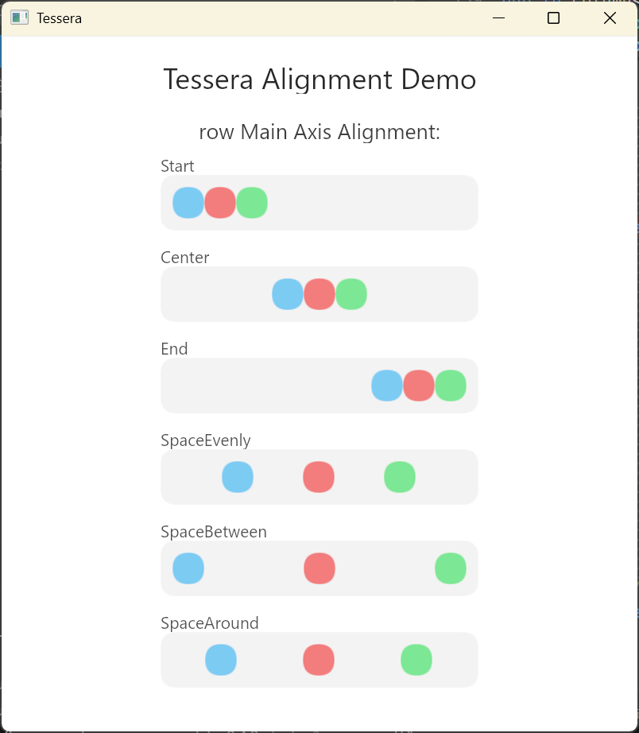
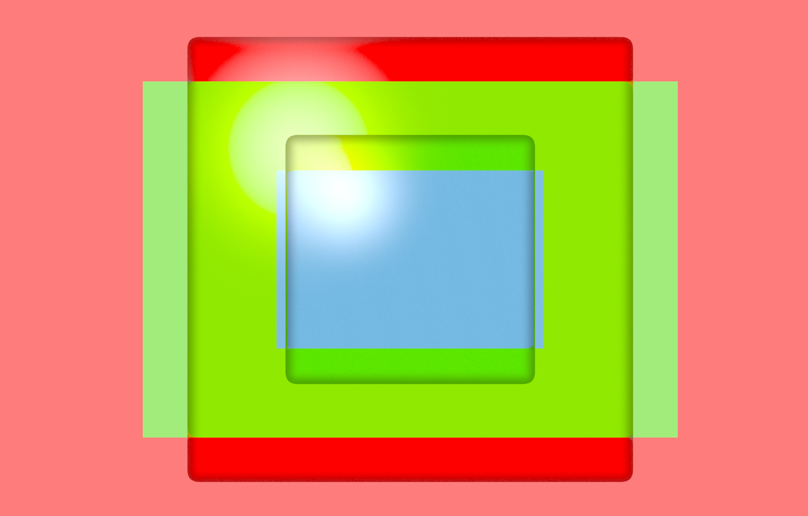
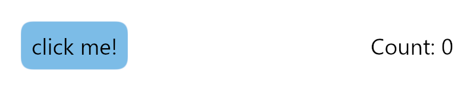

<div align="center">

# **Tessera (WIP)**

</div>

## Introduction

Tessera is a declarative, immediate-mode UI framework for Rust. With a functional approach at its core, it aims to provide ultimate performance, flexibility, and extensibility.

The project is currently in its early stages of development. Feel free to explore the latest progress through the [example code](example).

## Roadmap

Currently, the framework is in the early stages of development. The v0.1.0 roadmap includes:

- **Core**: Implement framework core (tessera), including

  - ~~Component tree~~
  - ~~Measurement System~~
  - ~~State Management~~
  - ~~Renderer, including pluggable shader system~~
  - ~~Basic types (`Dp`, `Px`)~~
  - ~~Focus management~~
  - ~~#[tessera] macro, for convenient component definition~~
  - Event handling
    - ~~Mouse events~~
    - ~~Touch events~~
    - ~~Raw Keyboard events~~
    - IME event (windows, linux, macOS) (partially completed)
    - IME event (android)
    - IME event (ios)

- **Basic Components**: Implement some basic components (tessera_basic_components), including

  - ~~row~~
  - ~~column~~
  - ~~boxed~~
  - ~~text~~
  - ~~spacer~~
  - text_editor (partially completed)
  - ~~button~~
  - ~~surface~~
  - ~~fluid_glass~~
  - ~~scrollable~~
  - ~~image~~
  - checkbox
  - radio
  - switch
  - slider
  - progress
  - dialog

## Core Features

- **Declarative Component Model**: Define and compose components using simple functions with the `#[tessera]` macro, resulting in clean and intuitive code.
- **Powerful and Flexible Layout System**: A constraint-based (`Fixed`, `Wrap`, `Fill`) layout engine, combined with components like `row` and `column` (inspired by Jetpack Compose), makes it easy to implement responsive layouts from simple to complex.

<p align="center">
    
</p>
<p align="center" style="color: gray;"><em>Example of `row`, viewable in `example/alignment_showcase.rs`</em></p>

- **Pluggable Shader Engine**: Shaders are first-class citizens in Tessera. The core of Tessera doesn't come with built-in drawing primitives like a "brush". Instead, it provides an easy-to-use WGPU rendering/compute pipeline plugin system, offering an experience closer to some game engines. This is intentional, for the following reasons:

  - **The Advent of WGPU**: The emergence of WGPU and WGSL has made shader programming simpler, more efficient, and easily adaptable to mainstream GPU backends. Writing shaders directly is no longer a painful process.
  - **Neumorphism**: In recent years, pure flat design has led to visual fatigue, and more applications are adopting neumorphic design styles. The main difference from the old skeuomorphism of the 2000s is its **hyper-realistic perfection**, which requires many visual effects that are difficult to implement uniformly, such as lighting, shadows, reflections, refractions, bloom, and perspective. Attempting to encapsulate a perfect "brush" to achieve these effects is very difficult and inelegant.
  - **Flexibility**: With custom shaders, we can easily implement advanced effects like custom lighting, shadows, particle systems, etc., without relying on the framework's built-in drawing tools.
  - **GPU Compute**: One of the biggest advantages of WGPU over its predecessors is that compute shaders are first-class citizens. A future-oriented framework should take full advantage of this. By using custom compute shaders, we can perform complex computational tasks such as image processing and physics simulations, which are often unacceptably inefficient to perform on the CPU.

<p align="center">
    
</p>
<p align="center" style="color: gray;"><em>Using custom shaders instead of a built-in brush allows us to easily achieve advanced glass effects like this. This example can be found in `example/boxed_showcase.rs`.</em></p>

- **Decentralized Component Design**: Thanks to the pluggable rendering pipeline, `tessera` itself does not include any built-in components. While `tessera_basic_components` provides a set of common components, you are free to mix and match or create your own component libraries.
- **Explicit State Management**: Components are stateless. State is passed in explicitly as parameters (usually in the form of `Arc<Lock<State>>` due to the highly parallel design), and interaction logic is handled within the `state_handler` closure, making data flow clear and controllable.
- **Parallelized By Design**: The framework utilizes parallel processing in its core. For example, the size measurement of the component tree uses Rayon for parallel computation to improve the performance of complex UIs.

## A Glance

Here is a simple counter application using `tessera_basic_components` that demonstrates the basic usage of `Tessera`.

```rust
/// Main counter application component
#[tessera]
fn counter_app(app_state: Arc<AppState>) {
    {
        let button_state_clone = app_state.button_state.clone(); // Renamed for clarity
        let click_count = app_state.click_count.load(atomic::Ordering::Relaxed);
        let app_state_clone = app_state.clone(); // Clone app_state for the button's on_click

        surface(
            SurfaceArgs {
                color: [1.0, 1.0, 1.0, 1.0], // White background
                padding: Dp(25.0),
                ..Default::default()
            },
            None,
            move || {
                row_ui![
                    RowArgsBuilder::default()
                        .main_axis_alignment(MainAxisAlignment::SpaceBetween)
                        .cross_axis_alignment(CrossAxisAlignment::Center)
                        .build()
                        .unwrap(),
                    move || {
                        button(
                            ButtonArgsBuilder::default()
                                .on_click(Arc::new(move || {
                                    // Increment the click count
                                    app_state_clone // Use the cloned app_state
                                        .click_count
                                        .fetch_add(1, atomic::Ordering::Relaxed);
                                }))
                                .build()
                                .unwrap(),
                            button_state_clone, // Use the cloned button_state
                            move || text("click me!"),
                        )
                    },
                    move || {
                        text(
                            TextArgsBuilder::default()
                                .text(format!("Count: {}", click_count))
                                .build()
                                .unwrap(),
                        )
                    }
                ];
            },
        );
    }
}
```

<p align="center">
    
</p>
<p align="center" style="color: gray;"><em>This example can be found in `example/counter.rs`</em></p>

## Core Concepts

1. **Component Model**
   `Tessera` components are regular Rust functions annotated with the `#[tessera]` macro. This macro integrates the component function into the framework's component tree. Inside the function body, you can call `measure` to customize layout logic, measure and place child component functions to build the UI hierarchy, and call `state_handler` to handle user interactions.

   `measure` and `state_handler` are automatically injected into the function context by the `tessera` macro and do not need to be imported.

2. **Layout & Measurement**
   The UI layout is determined during the "measurement" phase. Each component can provide a `measure` closure, in which you can:

   - Measure the size of child components (with constraints).
   - Use `place_node` to determine the position of child components.
   - Return the final size of the current component (`ComputedData`).
     If no `measure` closure is provided, the framework defaults to stacking all child components at `(0, 0)` and setting the container size to the minimum size that envelops all children.

3. **State Management**
   `Tessera` promotes an explicit state management pattern. Components are stateless; they receive shared state via parameters (usually `Arc<T>`). All state changes and event responses are handled within the `state_handler` closure, which makes the data flow unidirectional and predictable.

## Getting Started

`tessera` is currently in early development, and there is no stable way to create a project yet. The following uses the `example` crate as a showcase project that runs on Windows, Linux, macOS, and Android.

### Running the Example on Windows / Linux

```bash
# Enter the example directory
cd example
# Run
cargo run
```

### Running the Example on Android

1. **Install xbuild**

   ```bash
   cargo install xbuild
   ```

2. **Run the example**

   ```bash
   # Find your device ID
   x devices
   # Assuming device ID is adb:823c4f8b and architecture is arm64
   x run -p example --arch arm64 --device adb:823c4f8b
   ```

## Workspace Structure

Tessera uses a multi-crate workspace structure with a clear separation of responsibilities:

- **`tessera`**: The core functionality of the framework, including the component tree, renderer, runtime, basic types (`Dp`, `Px`), and event handling.
- **`tessera_basic_components`**: Provides a set of ready-to-use UI components (like `row`, `column`, `text`, `button`, `surface`) and their rendering pipelines.
- **`tessera_macros`**: Contains the `#[tessera]` procedural macro, which greatly simplifies component definition.
- **`example`**: An example project demonstrating how to build applications with the `Tessera` framework.
